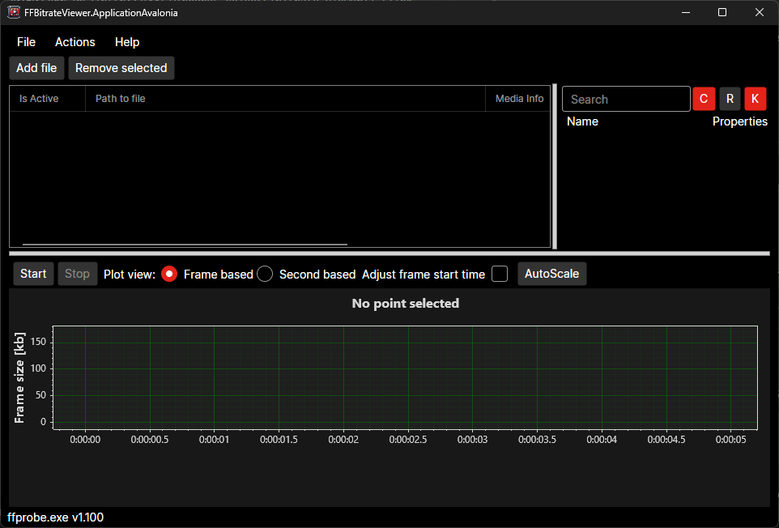
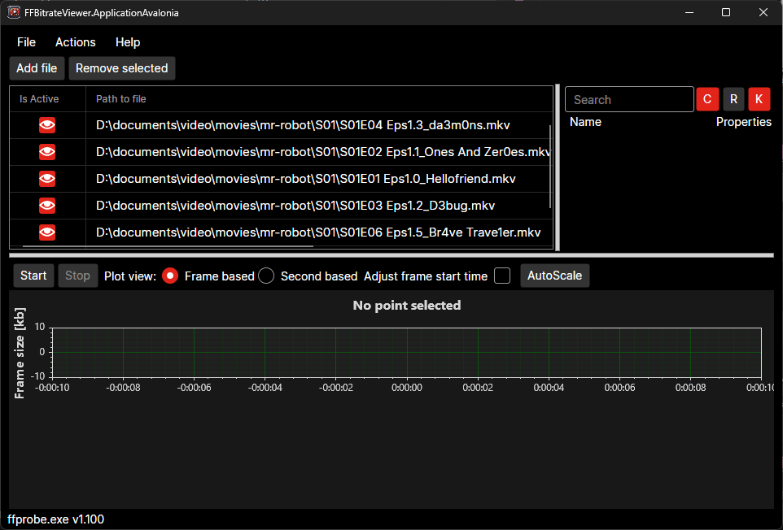
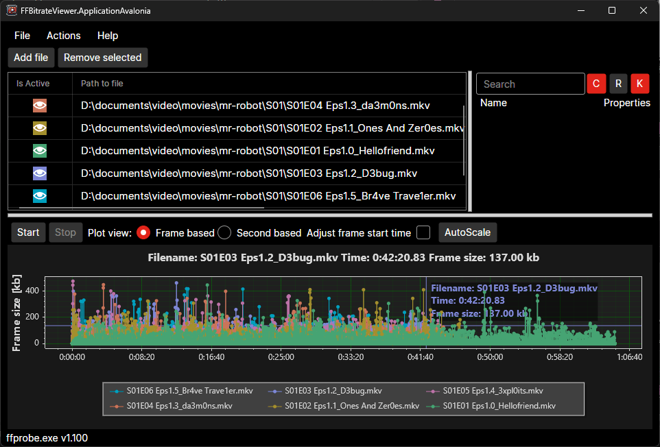
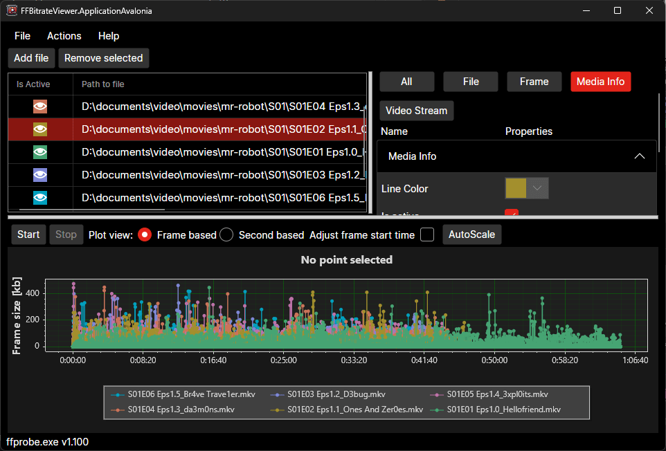
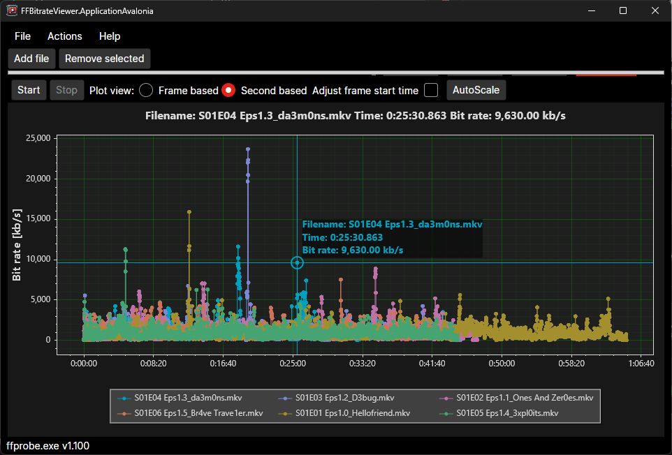

## FFBitrateViewer — yet another program for video file bitrate visualization

This version of `FFBitrateViewer` is a unofficial port of the original version. The original version states:

> _FFBitrateViewer is a FFProbe GUI that purpose is to visualize frames` bitrate extracted by FFProbe.
It is inspired by [Bitrate Viewer](https://web.archive.org/web/20160730053853/http://www.winhoros.de/docs/bitrate-viewer/) (link to Web Archive as the program's web-site and forum are long dead).
FFBitrateViewer allows you to select multiple files without dealing with command line and get “per frame” or “per second” info for all of them in one go._

This port has been built using cross platform technologies, allowing to run native desktop application on Windows, Mac and Linux.


## Screenshots

Default main window


Loaded Videos


Visualiza Video Info


Visualizing Bitrates


Expanded Plot View


## Features

- ✅ Process as many files as your computer can handle.
- ✅ Side property panel with brief media info for the selected file.
- ✅ Graphs can be zoomed in/out with mouse wheel (try it over graph and/or axes), panned.
- ✅ Save generated plot as image by using right mouse button or directly in menu
- ✅ FFProbe commands can be saved to a log file.
- ✅ No registration, banners, tracking etc;
- ✅ Support for CLI arguments
<!-- - ⛔ Easy to use UI: files can be added with file chooser or dropped from Windows Explorer, files can be re-ordered using Drag & Drop; -->

<!--
- Free;
- **Open Source** ([MIT License](LICENSE.txt)).
-->

## Latest version:
<!-- - Latest Beta: [0.8.0 beta 2](https://github.com/fifonik/FFBitrateViewer/releases/tag/v0.8.0-beta.2) -->


## Requirements

FFBitrateViewer depends on ffprobe executable, which it is included as part of ffmpeg.

Depending on your operating system you have to follow different steps to install ffmpeg and the ffprobe package. See oficial documentation at: https://ffmpeg.org/download.html

Each operating system normally provides stores or package managers which could help you to install software

For Windows thru [WinGet](https://winget.run/pkg/Gyan/FFmpeg):
```powershell
winget install -e --id Gyan.FFmpeg
```

For MacOS thru [Homebrew](https://formulae.brew.sh/formula/ffmpeg):
```shell
brew install ffmpeg
```

ffprobe should be in `PATH` environmental variable in oder to be used by FFBitrateViewer. This normally happens after you install ffmpeg. If you want to specify which ffprobe binary should be use, use the CLi option `-x` or `--FFProbeFilePath` along with the full path to the file.

<!--
Add notes on supported OS and required runtime
-->
## How to use

After you have download FFBitrateViewer. The most simple use is by:

1. Start the application
1. Add one or more video files
1. Click on `Start` to generate a graph

The application supports some CLI arguments that may become useful in some scnearios:

```log
Description:
  Visualizes video bitrate received by ffprobe (https://ffmpeg.org/)

Usage:
  FFBitrateViewer.ApplicationAvalonia.Desktop [options]

Options:
  -s, --StartTimeAdjustment <StartTimeAdjustment>       Time adjustment when compting the plot []
  -e, --Exit                                            [default: False]
  -l, --LogCommands                                     Whether or not to log executed commands [default: False]
  -a, --AutoRun                                         Whether or not start automatically the file processing. [default: False]
  -t, --TempDir <TempDir>                               Temporary directory [default: C:\Users\johndoe\AppData\Local\Temp\]
  -f, --Files <Files>                                   Input files []
  -p, --PlotViewType <FrameBased|GOPBased|SecondBased>  The kind of plot view selected by default [default: FrameBased]
  -x, --FFProbeFilePath <FFProbeFilePath>               The path to the executable ffprobe file []
  --version                                             Show version information
  -?, -h, --help                                        Show help and usage information
```
<!-- - Unpack into a folder;
- Put FFProbe.exe (and accompanied dll files if you use shared build) into the program folder or make it available through system %PATH%;
- Run the program;
- Use UI to add files;
- Click “Start” button. -->

<!--
## Troubleshooting
- Close FFBitrateViewer and delete `FFBitrateViewer.log`;
- Run the program with option `-log-level=debug`;
- Add file;
- Click “Start” button;
- Take screenshot (Alt+PrnScr or Win+Shift+S and paste it into image editor and save as PNG);
- Close the program;
- Analyze `FFBitrateViewer.log`. You can try to run the ffprobe command directly;
- Upload archived `FFBitrateViewer.log` with screenshot to dropbox (or similar) and share the link. -->


## Author
- Original Application by fifonik
- New ported version by [Herber Madrigal](mailto:hfmad@hotmail.com)

